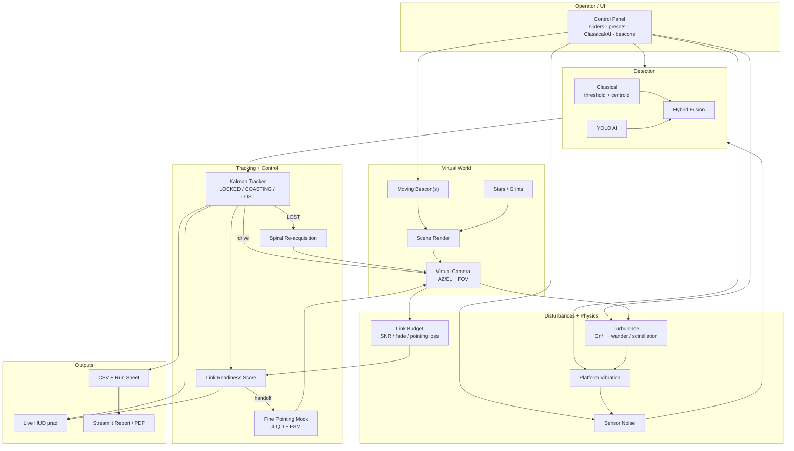

# FSOC Virtual Tracker — Architecture

**Diagram (preferred):** open [`architecture.html`](architecture.html) in a browser.

Legacy PNG (optional): [`architecture.png`](architecture.png) via `python scripts/render_architecture.py`.
Mermaid source below matches the same topology.

## Stages

| Stage | What it does |
|---|---|
| Operator / UI | Sliders, presets, detector mode, beacon count |
| Virtual World | Beacons + clutter rendered into camera FOV |
| Disturbances + Physics | Turbulence, vibration, noise, link SNR / fade |
| Detection | Classical and/or YOLO → hybrid fusion |
| Tracking + Control | Kalman states, spiral re-acq, fine handoff |
| Outputs | HUD, CSV / run sheet, Streamlit report / PDF |

**Scope:** pointing, acquisition, tracking only. Not message transmission.
