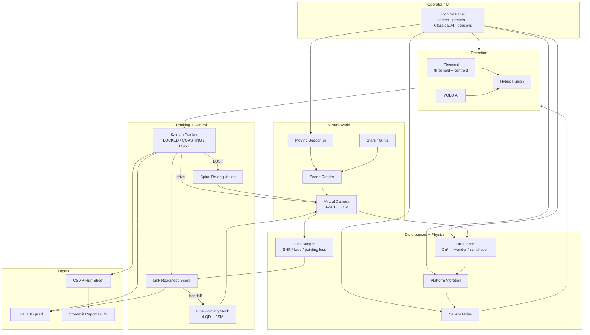

# FSOC Virtual Tracker — Technical Report (Draft)

**Team:** [Your team name]  
**Problem:** SIH — AI-assisted coarse PAT for FSOC mobile links  
**Version:** 1.0

---

## 1. Problem understanding

Free-Space Optical Communication (FSOC) enables gigabit-to-terabit data rates using narrow laser beams. Before a fine-pointing stage (fast steering mirror, quadrant detector) can close the link, a **coarse alignment stage** must:

1. Observe the scene via a wide-field camera  
2. Detect the remote beacon  
3. Estimate its position  
4. Continuously slew the camera/gimbal to keep the beacon in FOV  

Hardware PAT development requires expensive optics, gimbals, and test ranges. This project provides a **software virtual camera** for algorithm development, classical vs AI detector comparison, and quantitative performance logging.

### Standards context

Our parameters align with public references:

- **SDA OCT Standard v3.0.1** — PAT state machine, lead/follow acquisition  
- **ESA ESTOL** — acquisition time targets (&lt;60 s warm start)  
- **ESA IZN-1 ground station** — ~2.5 mrad acquisition FOV, µrad-class fine tracking  
- **ISRO Opto-Quantum Communication program** — gimbal + fine pointing PAT architecture (TEC/ISRO presentations)

We do **not** claim flight qualification or BER certification.

---

## 2. System architecture

**Architecture diagram:** open [`docs/architecture.html`](architecture.html) in a browser (HTML/SVG, preferred over PNG).

Full Mermaid / stage notes: [`docs/architecture.md`](architecture.md).



**Loop:** UI configures the scene → camera sees disturbed beacon → detect → Kalman track → slew / re-acquire / fine handoff → HUD + logs. No message modem.

### Module map

| Module | File | Role |
|---|---|---|
| Scene | `scene/scene.py` | Beacon motion (linear/circular/random walk) |
| Camera | `scene/camera.py` | FOV crop, slew limit, true IFOV ↔ µrad |
| Disturbances | `disturbance/disturbance.py` | Cn²-driven warp residual, vibration AR(1), sensor noise |
| Atmosphere | `physics/atmosphere.py` | Cn² → r₀, Rytov, beam wander, scintillation |
| Link budget | `physics/link_budget.py` | Gaussian beam P_rx / SNR / fade margin |
| Classical detector | `detector/classical_detector.py` | Threshold + contour centroid |
| AI detector | `detector/ai_detector.py` | YOLOv8n bounding-box centroid |
| Tracker | `tracker/kalman_tracker.py` | Constant-velocity Kalman, LOCKED/COASTING/LOST |
| Re-acquisition | `control/reacquisition.py` | Archimedean spiral search (literature-standard) |
| Fine pointing | `control/fine_pointing.py` | Readiness-gated 4-QD / FSM mock |
| Link readiness | `metrics/link_readiness.py` | SNR-informed handoff score |
| Logger | `metrics/logger.py` + `session_metrics.py` | CSV + JSON SIH metrics |
| UI | `ui/controls.py` | Sliders, presets, detector/trajectory buttons |
| Report | `report.py` | Streamlit analysis and comparison |

---

## 3. Tracking methods

### 3.1 Detection

**Classical:** Grayscale threshold (default 200) → largest contour centroid. Baseline for bright beacon on dark sky.

**AI:** YOLOv8n trained on 2400 synthetic frames from the same disturbance pipeline. Returns highest-confidence box centroid.

### 3.2 Estimation

4-state constant-velocity Kalman filter (filterpy). States: x, y, vx, vy.

| State | Condition |
|---|---|
| LOCKED | Valid detection this frame |
| COASTING | 1–15 consecutive missed frames |
| LOST | &gt;15 misses; spiral search activated |

Camera is driven by **Kalman estimate**, not ground truth.

### 3.3 Re-acquisition

On LOST, `ReacquisitionController` generates a spiral waypoint sequence biased along last known velocity (MDPI Photonics 11(6):540 spiral acquisition pattern). Camera slews at `max_slew_rate` until detector re-locks.

---

## 4. AI methods

1. **Synthetic data:** `scripts/generate_training_data.py` — varied turbulence, vibration, noise, trajectories  
2. **Training:** `scripts/train.py` — YOLOv8n, 320×320, copies best weights to `weights/beacon_yolov8n.pt`  
3. **Runtime:** Lazy-loaded `AIDetector` — same API as classical  

### Honest comparison — scenario matrix after hard curriculum

Training data regenerated to turb **0–8.5**, vib **0–25**, noise **0–0.75** (3000 frames), then 50-epoch GPU retrain. Matrix re-run (45 s, seed=42):

| Scenario | Classical err | AI err | Classical lock | AI lock | Reacq C/AI |
|---|---|---|---|---|---|
| Calm | 35.5 px | 35.5 px | 100% | 100% | 1 / 1 |
| UAV | 35.6 px | 35.6 px | 97.7% | **100%** | 1 / 1 |
| Stress | **35.1 px** | 36.1 px | 95.5% | 95.5% | 2 / **1** |

**Interpretation:** Mean pixel error is largely slew-lag limited (~35 px even in Calm), so it does not clearly separate detectors. AI improves **lock retention** under UAV and **reduces re-acquisitions** under Stress. Report that tradeoff honestly — do not claim Stress mean-error superiority the data does not support.

---

## 5. Link Readiness Score (novelty)

Physics-informed 0–1 score for **coarse-to-fine handoff** (default path):

```
score = 0.45×snr_sub + 0.25×pointing_loss + 0.15×scintillation + 0.15×lock
LOST → score = 0
```

SNR comes from `OpticalLink` (Tx power, divergence, range, pointing loss, scintillation). See `docs/link_readiness.md`. **Not a BER model.**

---

## 6. Test methodology

1. **Scenario presets:** Calm, UAV, Stress (`ui/scenarios.py`)  
2. **Matched-seed benchmark:** `scripts/run_comparison.py`  
3. **Metrics logged:** duration, FPS, pixel error, max error, lock retention %, acquisition time, processing time, re-acquisitions  
4. **Visualization:** `streamlit run report.py`  

---

## 7. Performance analysis

[Insert screenshots from Streamlit compare mode]

Session summary JSON example fields:
- `max_pixel_error_px`
- `lock_retention_pct`
- `avg_acquisition_time_s`
- `avg_processing_time_ms`

---

## 8. Limitations

- Atmospheric channel is **Andrews-style statistics** (Cn² → r₀, Rytov, wander, gamma-gamma scintillation), not a split-step / phase-screen propagator  
- Link budget is a directed Gaussian-beam SNR for handoff scoring — **not** a certified BER / outage model  
- Scene is a 2D sandbox with AZ/EL plant + IFOV mapping; not a full mechanical gimbal CAD model  
- AI trained on synthetic data only  
- Fine pointing (4-QD / FSM) includes mild channel noise + command latency, but is still a readiness-gated mock, not a calibrated flight plant  

---

## 9. Future improvements

1. Acquisition pattern A/B (spiral vs raster) under matched FOU + jitter  
2. Re-benchmark classical vs AI after clutter-heavy retrain  
3. Longer Monte Carlo campaigns for paper-quality confidence intervals  

---

## 10. References

1. SDA Optical Communications Terminal Standard v3.0.1  
2. ESA ESTOL air interface v2.2 (REQ-PHY-030 acquisition time)  
3. ESA IZN-1 Direct-to-Earth optical communications (EPIC 2024)  
4. MDPI Photonics 11(6):540 — Optimal spiral scanning for FSO acquisition  
5. Applied Optics 2024 — Deep vision YOLO FSO-PAT system  
6. Larry C. Andrews & Ronald L. Phillips — *Laser Beam Propagation through Random Media* (scintillation, r₀, beam wander)
7. IISc/QOSMIC — Probabilistic optical LEO link budget (arXiv:2507.20908)
8. ISRO Opto-Quantum Communication program overview (TEC)

---

*Convert this document to PDF for submission. Add team name, screenshots, and institution logo.*
